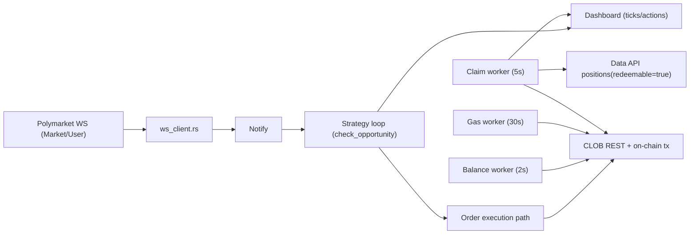

# polymarketrust

A Rust replication of a Polymarket arbitrage bot. This project ports the TypeScript logic from [`polymarket`](../polymarket) into idiomatic Rust, using `tokio` for async I/O and on-chain interactions.

## Features

- **WS-driven arbitrage detection** — event-based strategy loop (20ms throttle) with REST fallback heartbeat
- **GTC batched execution** — signs both legs concurrently, posts atomically, polls for fills
- **Partial-fill recovery** — smart hedge-or-sell-back when only one leg fills
- **WebSocket orderbook feed** — real-time updates from Polymarket's WS API with REST fallback
- **Maker mode** — optional GTC limit orders posted below best ask instead of FOK taker orders
- **Dynamic fee calculation** — `fee = CLOB_FEE_RATE × (price × (1 − price))^CLOB_FEE_EXPONENT`
- **Background maintenance workers** — balance (2s), claim polling (5s), and gas cache refresh (30s) off the WS hot path
- **Gas-aware profitability** — uses cached gas/POL pricing in strategy hot path
- **Circuit breaker** — pauses trading after N consecutive failures or daily loss limit
- **Position tracking** — recovers open YES/NO positions from trade history across restarts
- **Claim automation** — discovers redeemable conditions from Data API and redeems through Safe/EOA flow
- **Persistent stats** — `logs/market_stats.json` updated on market rollover
- **JSONL trade log** — every trade event appended to `logs/trades.jsonl`
- **Session log** — human-readable session file at `logs/session_<timestamp>.txt`

## Prerequisites

- Rust 1.75+ (`rustup update stable`)
- A funded Polygon wallet (USDC for trading, POL for gas)
- Polymarket API credentials (generate with `cargo run --bin biogen`)

## Quick Start

```bash
# 1. Clone and enter the project
cd polymarketrust

# 2. Copy environment template
cp .env.example .env

# 3. Fill in PRIVATE_KEY in .env, then generate API credentials
cargo run --bin biogen

# 4. Add the generated credentials to .env

# 5. Check your proxy wallet setup
cargo run --bin check_proxy

# 6. Verify connectivity with a test order
cargo run --bin test_order

# 7. Inspect claimable conditions (optional)
cargo run --bin check_claim

# 8. Run the bot
cargo run --release
```

## Configuration

All settings live in `.env`. See `.env.example` for documentation on each variable.

Key parameters:

| Variable | Default | Description |
|---|---|---|
| `MARKET_SLUG` | `btc-updown-15m` | Market slug prefix (comma-separated for multi-market) |
| `MAX_TRADE_SIZE` | `50` | Max shares per arb execution |
| `MIN_NET_PROFIT_USD` | `0.05` | Minimum profit threshold |
| `MOCK_CURRENCY` | `false` | Paper trading mode (no real orders) |
| `WS_ENABLED` | `true` | Enable WebSocket feed |
| `MAKER_MODE_ENABLED` | `false` | Use GTC limit orders instead of FOK |
| `MAX_DAILY_LOSS_USD` | `10.0` | Daily loss circuit breaker |

## Architecture

```
src/
├── main.rs            # Scheduler & signal handling
├── config.rs          # Environment configuration & fee math
├── types.rs           # Shared types (OrderBook, SignedOrder, etc.)
├── clob_client.rs     # Polymarket CLOB REST API + EIP-712 signing
├── ws_client.rs       # WebSocket orderbook feed
├── market_monitor.rs  # Core orchestrator (arb detection & execution)
├── maker_strategy.rs  # GTC limit order maker mode
├── market_stats.rs    # Persistent statistics
├── trade_logger.rs    # JSONL trade event log
├── logger.rs          # Session file logger
└── bin/
    ├── biogen.rs      # Generate API credentials
    ├── check_proxy.rs # Proxy wallet diagnostics
    ├── check_claim.rs # Claimability + redemption diagnostics
    └── test_order.rs  # Single order connectivity test
```

## Runtime Logic UML

The current runtime architecture is documented in [`docs/runtime-logic-uml.md`](docs/runtime-logic-uml.md), including:

- WS hot-path flow
- background maintenance workers
- rollover/reconnect behavior
- claim/redeem flow
- known logic gaps and risk points

Quick view:



## Fee Formula

Polymarket's CLOB uses a polynomial fee model:

```
fee_per_share = CLOB_FEE_RATE × (price × (1 − price))^CLOB_FEE_EXPONENT

At price = 0.50 with defaults (rate=0.25, exp=2):
  fee = 0.25 × (0.25)² = 0.25 × 0.0625 = 0.015625 (1.56%)

Arbitrage is profitable when:
  yesAsk + noAsk < 1.0 − max(yesFee, noFee)
```

## Known Logic Gaps

- **WS delta cadence can appear bursty**: quiet periods with no orderbook deltas are expected; the dashboard currently shows change-only ticks.
- **Single monitor mutex remains a contention risk**: network I/O was moved out of the strategy hot path, but long synchronous sections can still delay concurrent tasks.
- **Safe redemption confirmation depth**: tx receipt success is tracked, but deeper Safe event-level validation should still be strengthened.
- **Tooling parity**: `rustfmt` is not yet installed in the current environment, so formatting consistency depends on developer setup.

## Security

Never commit your `.env` file. It is listed in `.gitignore`.

## License

MIT
