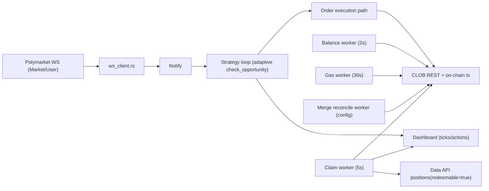

# polymarketrust

A Rust replication of a Polymarket arbitrage bot. This project ports the TypeScript logic from [`polymarket`](../polymarket) into idiomatic Rust, using `tokio` for async I/O and on-chain interactions.

## Features

- **WS-driven arbitrage detection** — event-based strategy loop with adaptive triggering and REST fallback heartbeat
- **Event-driven fill tracking** — User WS events are primary for fills with stale-poll fallback
- **GTC batched execution** — signs both legs concurrently and submits paired legs with harder-to-fill-first ordering
- **Partial-fill recovery** — smart hedge-or-sell-back when only one leg fills
- **Strict-neutral entry lock** — new entries are blocked until inventory ambiguity/imbalance is resolved
- **Hard timeout recovery lock** — ambiguous submit timeouts trigger deterministic recovery before resuming
- **WebSocket orderbook feed** — real-time updates from Polymarket's WS API with REST fallback
- **Strategy selector** — choose `post-only` (new market-maker mode), `taker`, or legacy `maker`
- **Dynamic fee calculation** — `fee = CLOB_FEE_RATE × (price × (1 − price))^CLOB_FEE_EXPONENT`
- **Background maintenance workers** — balance (2s), claim polling (5s), and gas cache refresh (30s) off the WS hot path
- **Merge reconciliation worker** — periodic reserved-state reconciliation for merge confirmations/failures
- **Shadow rollout controls** — can run decisioning live while disabling actual order submission
- **Gas-aware profitability** — uses cached gas/POL pricing in strategy hot path
- **Circuit breaker** — pauses trading after N consecutive failures or daily loss limit
- **Position tracking** — recovers open YES/NO positions from trade history across restarts
- **Claim automation** — discovers redeemable conditions from Data API and redeems through Safe/EOA flow
- **Persistent stats** — `logs/market_stats.json` updated on market rollover
- **JSONL trade log** — every trade event appended to `logs/trades.jsonl`
- **Session log** — human-readable session file at `logs/session_<timestamp>.txt`

## Prerequisites

- Rust 1.75+ (`rustup update stable`)
- A funded Polygon wallet (USDC for trading, POL for gas)
- Polymarket API credentials (generate with `cargo run --bin biogen`)

## Quick Start

```bash
# 1. Clone and enter the project
cd polymarketrust

# 2. Copy environment template
cp .env.example .env

# 3. Fill in PRIVATE_KEY in .env, then generate API credentials
cargo run --bin biogen

# 4. Add the generated credentials to .env

# 5. Check your proxy wallet setup
cargo run --bin check_proxy

# 6. Verify connectivity with a test order
cargo run --bin test_order

# 7. Inspect claimable conditions (optional)
cargo run --bin check_claim

# 8. Run the bot
cargo run --release
```

## Configuration

All settings live in `.env`. See `.env.example` for documentation on each variable.

Key parameters:

| Variable | Default | Description |
|---|---|---|
| `MARKET_SLUG` | `btc-updown-15m` | Market slug prefix (comma-separated for multi-market) |
| `MAX_TRADE_SIZE` | `12` | Max shares per arb execution (stability-first) |
| `MIN_PAIRED_SHARES` | `5` | Minimum net paired size after fee adjustment (post-only quotes auto-scale to satisfy this) |
| `MIN_CHILD_ORDER_SIZE` | `5` | Minimum child slice size for taker batching |
| `TARGET_CHILD_ORDER_SIZE` | `12` | Target child slice size for taker batching |
| `MAX_TAKER_BATCHES` | `1` | Upper bound on child slices per opportunity |
| `MIN_RESCUE_BUY_SHARES` | `1` | Minimum BUY hedge size for partial-fill rescue paths |
| `MIN_IMBALANCE_BUY_SHARES` | `1` | Minimum BUY hedge size for imbalance neutralization |
| `MIN_IMBALANCE_SELL_SHARES` | `5` | Minimum SELL hedge size for imbalance sell-back paths |
| `MIN_NET_PROFIT_USD` | `0.08` | Minimum profit threshold |
| `STRICT_NEUTRAL_MODE` | `true` | Block new entries while imbalance/recovery lock is active |
| `NEUTRALITY_RESUME_NET_SHARES` | `0.25` | Resume only when net imbalance is at or below this |
| `TIMEOUT_RECOVERY_LOCK_SECS` | `10` | Lock duration for post-timeout deterministic recovery |
| `TIMEOUT_RECOVERY_POLL_MS` | `200` | Poll cadence during timeout recovery |
| `MIN_LEG_PRICE` | `0.12` | Skip opportunities with near-resolved legs |
| `MOCK_CURRENCY` | `false` | Paper trading mode (no real orders) |
| `WS_ENABLED` | `true` | Enable WebSocket feed |
| `STRATEGY_MODE` | `taker` | Execution path: `post-only` (new market-maker mode, recommended), `taker`, or legacy `maker` |
| `MAKER_MODE_ENABLED` | `false` | Legacy fallback when `STRATEGY_MODE` is unset |
| `TAKER_ORDER_TYPE` | `FAK` | Immediate taker type (`FAK` or `FOK`) |
| `HEDGE_ORDER_TYPE` | `FAK` | Hedge/sell-back order type (`FAK` preferred for stability) |
| `PRE_SUBMIT_SIGNAL_MAX_AGE_MS` | `350` | Drop stale opportunities before order submit |
| `PRE_SUBMIT_PAIR_DRIFT_MAX` | `0.006` | Max allowed pair-cost drift before submit |
| `PRE_SUBMIT_MIN_LIQ_FACTOR` | `0.95` | Min depth fraction required at submit time |
| `WS_FILL_PRIMARY` | `true` | Use User WS stream as primary fill source |
| `WS_FILL_FALLBACK_POLL_MS` | `300` | Poll fallback interval when WS fill stream is stale |
| `SDK_POST_TIMEOUT_MS` | `3000` | Timeout for order submit calls |
| `POST_BATCH_MAX_RETRIES` | `1` | Retries for transient batch submit failures |
| `GAMMA_REQUEST_RETRIES` | `2` | Gamma discovery retry count per query |
| `GAMMA_RETRY_BASE_MS` | `300` | Base backoff between Gamma retries |
| `DISCOVERY_DEGRADED_SECS` | `60` | Continuous discovery failure threshold before degraded warning |
| `SDK_RETRY_BASE_DELAY_MS` | `60` | Retry backoff base delay |
| `SDK_RETRY_MAX_DELAY_MS` | `600` | Retry backoff cap |
| `DISABLE_SYSTEM_PROXY` | `true` | Ignore `HTTP(S)_PROXY` for lower-latency direct path |
| `ADAPTIVE_THROTTLE_MIN_MS` | `0` | Minimum trigger interval for actionable deltas |
| `ADAPTIVE_THROTTLE_BURST_DEBOUNCE_MS` | `8` | Debounce interval for noisy WS bursts |
| `ACTIONABLE_DELTA_MIN_TICKS` | `1` | Tick movement threshold treated as actionable |
| `SHADOW_ENGINE_ENABLED` | `true` | Enable shadow-mode execution path |
| `SHADOW_ENGINE_SEND_ORDERS` | `false` | If `false`, model decisions but do not send orders |
| `MERGE_RECONCILE_INTERVAL_SECS` | `5` | Merge reconciliation cadence |
| `MAX_DAILY_LOSS_USD` | `10.0` | Daily loss circuit breaker |

### Live Trading vs Shadow Mode

- `MOCK_CURRENCY=false` controls paper-trading vs real wallet mode.
- `SHADOW_ENGINE_ENABLED=true` and `SHADOW_ENGINE_SEND_ORDERS=false` means:
  - the bot still detects opportunities and computes execution,
  - but it does **not** submit real orders.
- For live order submission with the new engine:
  - set `SHADOW_ENGINE_SEND_ORDERS=true` (you may keep `SHADOW_ENGINE_ENABLED=true`),
  - restart the bot.

### Recommended Post-Only Settings

Use these when running the new market-maker mode:

```env
STRATEGY_MODE=post-only
MAKER_SPREAD_TICKS=2
MIN_PAIRED_SHARES=5
MIN_SELL_RESCUE_SHARES=5
MIN_IMBALANCE_SELL_SHARES=5
MIN_RESCUE_BUY_SHARES=1
MIN_IMBALANCE_BUY_SHARES=1
```

Notes:
- Resting quote size is fee-aware: gross quote size is automatically increased when needed so net paired shares can still satisfy `MIN_PAIRED_SHARES` after fees.
- Resting-mode fills are tracked as **net-after-fee deltas** (not cumulative gross), which keeps imbalance/sellback thresholds aligned with what is actually sellable.

## Architecture

```
src/
├── main.rs            # Scheduler & signal handling
├── config.rs          # Environment configuration & fee math
├── types.rs           # Shared types (OrderBook, SignedOrder, etc.)
├── clob_client.rs     # Polymarket CLOB REST API + EIP-712 signing
├── ws_client.rs       # WebSocket orderbook feed
├── market_monitor.rs  # Core orchestrator (arb detection & execution)
├── maker_strategy.rs  # Legacy resting-quote maker strategy
├── post_only_strategy.rs # postOnly=true resting-quote strategy
├── market_stats.rs    # Persistent statistics
├── trade_logger.rs    # JSONL trade event log
├── logger.rs          # Session file logger
└── bin/
    ├── biogen.rs      # Generate API credentials
    ├── check_proxy.rs # Proxy wallet diagnostics
    ├── check_claim.rs # Claimability + redemption diagnostics
    └── test_order.rs  # Single order connectivity test
```

## Runtime Logic UML

The current runtime architecture is documented in [`docs/runtime-logic-uml.md`](docs/runtime-logic-uml.md), including:

- WS hot-path flow
- background maintenance workers
- rollover/reconnect behavior
- claim/redeem flow
- known logic gaps and risk points

Quick view:



## Fee Formula

Polymarket's CLOB uses a polynomial fee model:

```
fee_per_share = CLOB_FEE_RATE × (price × (1 − price))^CLOB_FEE_EXPONENT

At price = 0.50 with defaults (rate=0.25, exp=2):
  fee = 0.25 × (0.25)² = 0.25 × 0.0625 = 0.015625 (1.56%)

Arbitrage is profitable when:
  yesAsk + noAsk < 1.0 − max(yesFee, noFee)
```

## Known Logic Gaps

- **WS delta cadence can appear bursty**: quiet periods with no orderbook deltas are expected; the dashboard currently shows change-only ticks.
- **Single monitor mutex remains a contention risk**: network I/O was moved out of the strategy hot path, but long synchronous sections can still delay concurrent tasks.
- **Safe redemption confirmation depth**: tx receipt success is tracked, but deeper Safe event-level validation should still be strengthened.
- **Tooling parity**: `rustfmt` is not yet installed in the current environment, so formatting consistency depends on developer setup.

## Security

Never commit your `.env` file. It is listed in `.gitignore`.

## License

MIT
