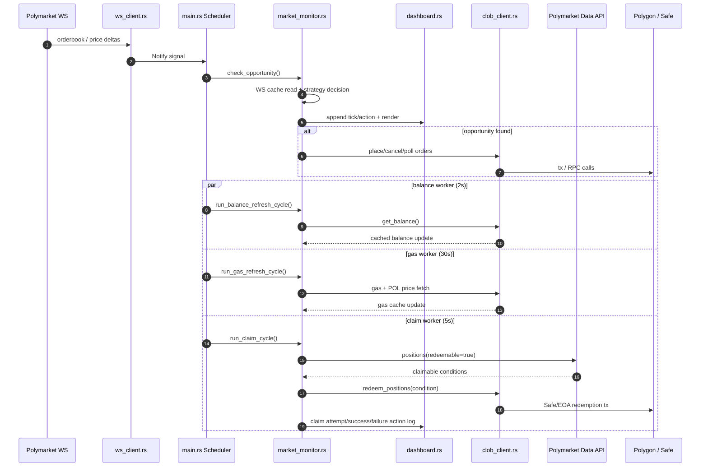
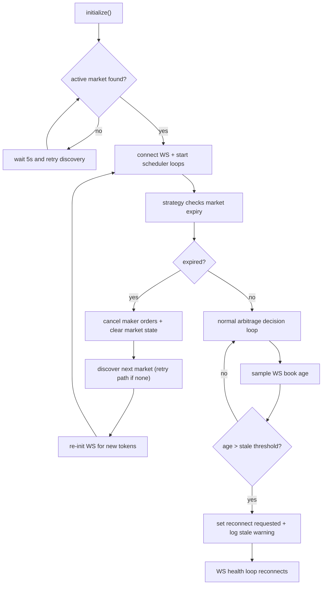

# Runtime Logic UML and Gap Map

This document describes the current execution model and highlights where logic gaps or residual risks still exist.

## 1) Runtime Sequence (WS Hot Path + Background Workers)

## 2) Control Flow (No-Market + Rollover + Stale WS)

## 3) Gap Map (Current)

| Area | Current Behavior | Gap / Risk | Suggested Next Hardening |
|---|---|---|---|
| WS tick continuity | change-only tick rendering | quiet periods can look like pauses even when healthy | optional heartbeat line with latest age/connection status |
| Concurrency model | single `MarketMonitor` mutex shared across loops | long critical sections can still delay loop scheduling | split state into finer-grained locks (`strategy`, `account`, `claims`) |
| Safe tx confirmation | tx hash + receipt driven confirmation | receipt success may not capture full Safe execution semantics | parse Safe execution events and fail on `ExecutionFailure` |
| Claim retries | cooldown + suppression windows | repeated API lag can still create temporary stale pending-claim display | add per-condition state machine with explicit terminal outcomes |

## 4) Operational Checks

- Ensure `logs/session_*.txt` contains explicit `Claim attempt` and `Redemption confirmed/failed` lines.
- Track WS age lines in dashboard:
  - `WS age: Up=<ms> | Down=<ms>`
- Watch periodic perf logs (p50/p95) for:
  - `check_opportunity`
  - `claim cycle`
  - `balance refresh`
